# Agentic Enterprise

## Description

Agentic is a sample system designed to offer intelligent business services through an agent-based architecture. 
The project consists of multiple services working together using MCP (Model Control Protocol) to provide comprehensive solution.

## Architecture

The system architecture is based on three main components that communicate with each other:

- A central application agent that receives user requests
- A RAG (Retrieval Augmented Generation) service to answer queries with contextual knowledge, exposed via MCP.
- A monitoring service to provide system status information, exposed via MCP.

```mermaid
flowchart TD
    subgraph application["application-agent (Port: 8080)"]
        app["🤖 Application Agent"]
        style app fill:#f0f0f0,stroke:#333,stroke-width:2px
        mc1["Monitor MCP Client"]
        mc2["RAG MCP Client"]
        app --- mc1
        app --- mc2
        style app font-weight:bold
    end
    
    subgraph system-status["Monitor Service (Port: 8081)"]
        status["🤖 System Status Service"]
        style status fill:#eef7e6,stroke:#333,stroke-width:2px
        status-server["Monitor MCP Server"]
        status --- status-server
        style status font-weight:bold
    end

    subgraph rag-service["RAG Service (Port: 8082)"]
        rag["🤖 RAG Agent"]
        style rag fill:#e6f7ff,stroke:#333,stroke-width:2px
        rag-server["Rag MCP Server"]
        kb["Redis Vector Store"]
        rag --- rag-server
        rag --- kb
        style rag font-weight:bold
    end

    %% Increased spacing between components using invisible nodes
    invisible1[" "]
    invisible2[" "]
    
    application ~~~ invisible1 ~~~ rag-service
    application ~~~ invisible2 ~~~ system-status
    
    %% Connect with longer edges
    mc1 --> rag-server
    mc2 --> status-server

    %% Hide invisible nodes
    style invisible1 fill:none,stroke:none
    style invisible2 fill:none,stroke:none

    classDef server fill:#f0f0f0,stroke:#666,stroke-width:1px
    class rag-server,status-server server

    classDef client fill:#f0f0f0,stroke:#666,stroke-width:1px
    class mc1,mc2 client

    classDef data fill:#f9f9f9,stroke:#999,stroke-width:1px
    class kb,api data
```



## Modules

### application-agent

Main agent that receives user requests, via rest endpoint, and orchestrates the other services.

**Configuration**:
- **Port**: 8080
- **Dependencies**: Connects to `rag` and `monitor` services via MCP clients

**Configuration file**: [application.yml](application-agent/src/main/resources/application.yml)

### rag

Retrieval Augmented Generation (RAG) agent that provides responses based on stored knowledge.
Redis vector store is used for efficient indexing and retrieval of information.

**Configuration**:
- **Port**: 8081
- **Type**: MCP Server
- **Storage**: Redis Vector Store for efficient indexing and retrieval

**Configuration file**: [application.yml](rag/src/main/resources/application.yml)

### monitor

**Role**: Monitoring service that provides information about the system status.

**Configuration**:
- **Port**: 8082
- **Type**: MCP Server
- **Functionality**: Collects fict data about system health and performance

**Configuration file**: [application.yml](monitor/src/main/resources/application.yml)

## Running the Project

### Redis

```bash
cd environment;
docker-compose up -d
```

### Starting Services

**1. Start the RAG service**:
```bash
cd rag
mvn spring-boot:run
```

**2. Start the monitor service**:
```bash
cd monitor
mvn spring-boot:run
```

**3. Start the application agent**:
```bash
cd application-agent
mvn spring-boot:run
```

## Usage

Send requests to the application agent on port 8080. The system will coordinate communication with the RAG and monitor services to retrieve 
the necessary information and respond accordingly.

## Video

Audio is awful. Just watch the video without sound. 🙂

[](https://www.loom.com/embed/8f2e07544fa1403c9f6fb2e07c817ad0)


